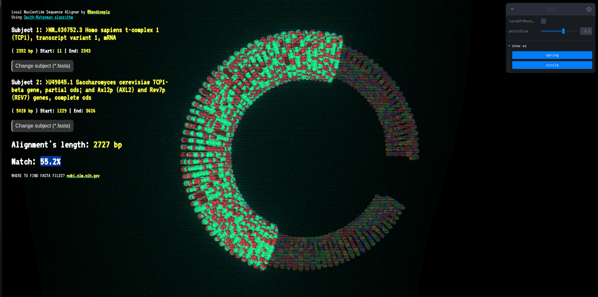

# Local Nucleotide Sequence Aligner

JavaScript implementation of the [Smith–Waterman algorithm](https://en.wikipedia.org/wiki/Smith%E2%80%93Waterman_algorithm) + visualization using [Three.js](https://threejs.org/). It expects a [FASTA](https://en.wikipedia.org/wiki/FASTA) file.

## What is DNA alignment?

DNA alignment is the process of comparing two (or more, but in this implementation it is 2) DNA sequences to identify regions of similarity. These similarities can indicate functional, structural, or evolutionary relationships between the sequences.

The **Smith–Waterman algorithm** performs **local alignment**, which means it finds the most similar region between two sequences, rather than comparing the entire length. This is useful when sequences might only partially match.

## How to Use

1. Prepare a FASTA file containing one or more DNA sequences (e.g., using characters A, T, C, G).
2. Load the FASTA file into the app 
3. The algorithm will align pairs of sequences and compute their best local matches.
4. Results are visualized in 3D using Three.js to help interpret scoring patterns and alignment regions.

## Features

- Parses standard FASTA files.
- Implements the Smith–Waterman algorithm for local alignment.
- Visualizes scoring matrix and alignments in a 3D environment.
- Highlights matching regions and alignment scores.

## Installation

```bash
npm install
npm run dev
